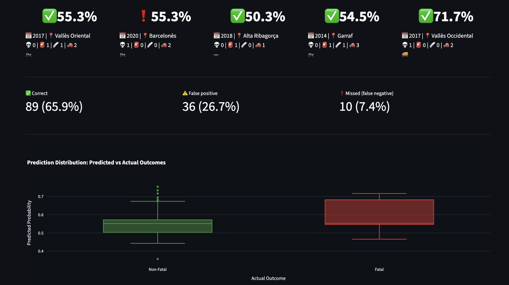
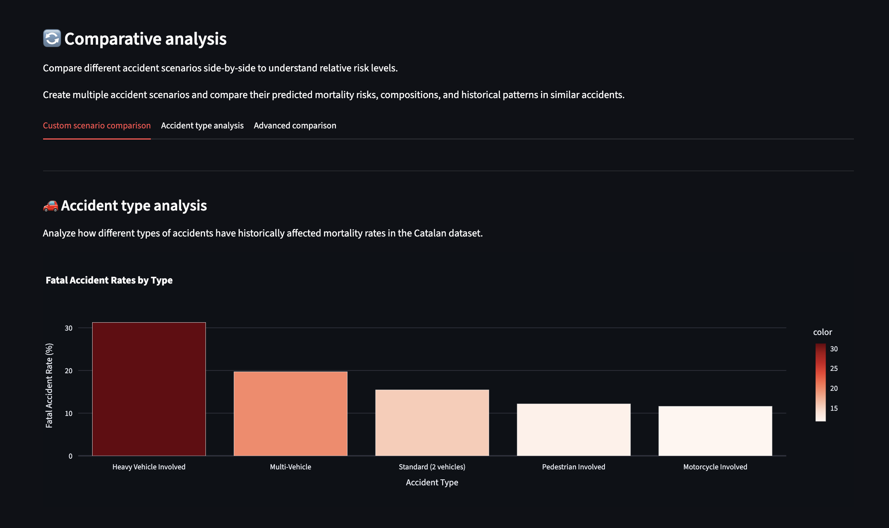
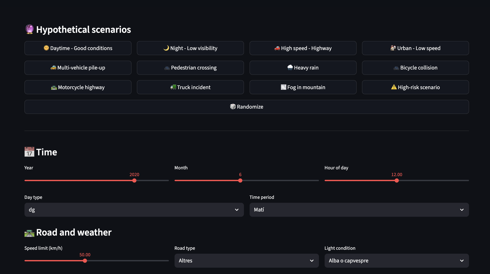

---

# A machine learning system for mortality prediction in Catalan traffic accidents

#### A project for the **UPF - Visual Analytics** course, 2025

This repository contains the development of a machine learning system for predicting mortality risk in traffic accidents, based on [publicly-available accident data from 2010-2023 across Catalonia](https://analisi.transparenciacatalunya.cat/Transport/Accidents-de-tr-nsit-amb-morts-o-ferits-greus-a-Ca/rmgc-ncpb/about_data). The snapshot used in this project (exported on 2025-12-04) is included in the repository as `data/accidents_catalonia_2010_2023.csv`.

Our approach, as expected, combines exploratory data analysis, training and assessment of multiple machine learning models, and explainable AI techniques to understand which features matter most when predicting whether an accident will result in fatalities. These insights enable running **hypothetical scenarios** to assess mortality risk, analyzing **past accidents** to understand outcomes, and informing **present interventions** to reduce deadly accidents in the future; all via a user-friendly interactive web application we were tasked to build with Streamlit.

  

It was developed in a short 2-day sprint timeframe (see [commit history](https://github.com/uripont/catalan-traffic-accident-analysis/commits/main/)) while studying for our final exams and finishing other final projects, and it is designed for use cases in fields like public safety, traffic management, insurance risk assessment and emergency response.

## Project structure

```plaintext
.
├── data/                      # Traffic accident dataset from Catalonia (2010-2023)
├── models/                    # Trained machine learning models and metadata
├── notebooks/                 # Jupyter notebooks for analysis and model development
├── src/                       # Streamlit interactive web application
│   ├── app.py
│   ├── components/
│   ├── pages/
│   │   ├── comparative_analysis.py
│   │   ├── hypothetical_scenarios.py
│   │   └── past_accident_analysis.py
│   └── utils/
├── output/                    # Generated outputs and processed data
├── .gitignore
├── LICENSE
├── pyproject.toml             # Project dependencies
└── README.md
```

## Requirements

- Python 3.10 or higher
- `uv` package manager ([install uv](https://docs.astral.sh/uv/getting-started/installation/))
- All Python dependencies are specified in `pyproject.toml`

## Setup

This project uses `uv` for Python environment management.

1. Clone the repository and navigate to the project directory
2. Create and activate the virtual environment:

```bash
uv sync
source .venv/bin/activate
```

On Windows:

```bash
uv sync
.venv\Scripts\activate
```

### Running the application

To launch the interactive Streamlit application:

```bash
streamlit run src/app.py
```

To work with the analysis notebooks:

```bash
jupyter notebook notebooks/
```

### Updating dependencies

To add new packages, edit `pyproject.toml` and run:

```bash
uv sync
```
